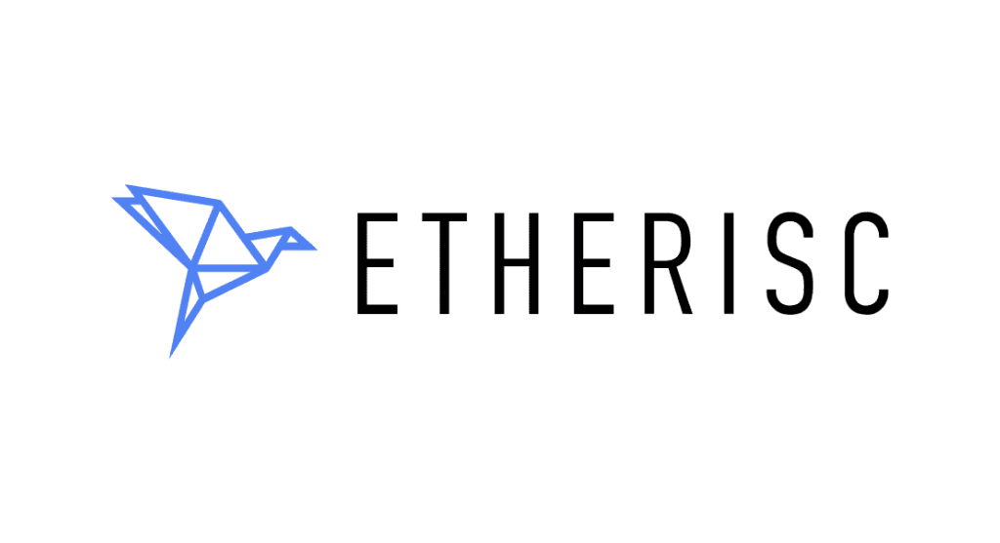

### Overview and Origin

* **Name of Company**
> Decentralized Insurance Foundation

* **When was the company incorportated?**
> The company was founded on July 28th, 2016.

* **How did the idea for the company (or project) come about?** 
> The mission of Etherisc is to build an open protocol for decentralized insurance applications, making it more efficient, enabling lower operational costs, providing greater transparency into the industry compared to traditional operations, and democratize access to reinsurance investments. Three demos have already been developed for three different insurance fields: Flight Delay DAPP, Social Insurance and Crop Insurance. 

* **How is the company funded? How much funding have they received?**
> The compay was funded via ICO. ICO - Initial Coin Offering.  The toke sale took place from June 25th to July 23rd, 2018. A total sum of 8,035 ETH was raised which is equavalent to 3,644,240.00 USD. 

### Business Activities: 

* **What specific financial problem is the company or project trying to solve?**
> The insurance market is dominated by large, traditional players including institutional underwriters, brokers, and resellers. Insurance companies act as intermediaries between protection seekers who want to share some risk on one side and investors who provide capital to cover risks on the other side. In return for the provision of capital investors get access to an insurance-backed asset class. Insurance companies are highly centralized and hierarchical organizations with much longer software development lifecycles than modern technology companies. At the same time, it is challenging for new competitors to enter the market because of strong network effects: insurance is a big numbers game, and this gives incumbents strong statistical and marketing
advantages. Tight regulation and entrenched interests have allowed the industry to resist business model disruption for many years. As a highly automatable platform for efficient custom economics systems, blockchain technology is well-suited to disrupt the insurance industry. With the advent of decentralized smart contract platforms there is now sufficiently mature technology for viable end-to-end digital insurance solutions and thus disintermediation of these markets. We foresee that blockchain technology will impact insurance products.

* **Who is the company's intended customer? Is ther any information about the market size of this set of customers? What solution does theis comapny offer that their competitors do not or cannot offer? -- What is the unfair advantage?**
> Etherisc is building a platform for decentralized insurance applications. It's model is B2B and B2C. Insurance companies speacialize in different industries: travel, health,and auto. Etherisc started with the travel insurance "Flight Delay Insurance". According to Allied Market Research the global travel insurance market size was valued at 19.2 billion USD in 2019. 
The insurance industry has room for improvement. For example Etherisc is streamlining the process of claims. The claim is processed within minutes without submitting a claim which no insurance is offering or even have capacity to offer. Etherisc advantage is using blockchain technology which helps to streamline the process of claim efficiently and reduce operational costs. 
* **Which techologies are they currently using, and how are they implemeting them?** 
> Currently, Etherisc is using Etherium blockchain techonology. The blockhain techonolgy is a new techonogly which is not very friendly to non-technicall users. But, developers are working on improving the UI,user interface, and UX,user experience, for regual users. 

### Landscape: 

* **What domain of the financial industry is the company in?**
> Etheris is in insurance domain. 

* **What have been the major trends and innovations of this domain over the last 5-10 years?**
> Insurers are starting to put the customer at the heart of everything they do. By activating and collecting the right data – from IoTs such as connected cars, activity trackers, and even toothbrushes! They’re able to better understand consumer needs and offer customized advice, coverage, and tailored pricing. This shift indicates insurers are now viewing consumers as individuals, rather than customer segments.
Usage-based insurance policies, for instance, tap into customer data in order to charge users according to their specific needs and behaviors, putting the consumer in charge of their own fees.
Such personalization and clever data-usage benefit both customers and insurers. Along with improving user satisfaction, tailored products enable companies to enjoy more accurate risk assessment, and stable margins.
And while asking users to share their location with your business might sound invasive, a study by Morgan Stanley and BCG suggests that customers are ready to share it (in return for the aforementioned benefits) as long as companies are transparent about how it will be used.
Example of insurers using IoTs: Beam uses IoT technology to offer dental insurance. Customers receive a ‘smart’ toothbrush that tracks how well customers take care of their teeth and provides personalized insurance plans based on this teeth-brushing data. In doing so, the firm claims they can offer rates up to 25% cheaper than competitors – a deal customers are sinking their teeth into.
Example of AI in insurance: Shift Technology offers AI-based anti-claims-fraud detection software. The company developed their automation solutions specifically for the insurance industry and the unique challenges insurers face.

* **What are the other major comapnies in this domain?** 
> The list of major companies:
> * State Farm (Market Share: 9.27%)
> * Berkshire Hathaway (Market Chare: 6.51%)
> * Progressive Group (Market Share: 5.54%)
> * Liberty Mutual (Market Share: 5.03%)
> * Allstate (Market Share: 4.95%)
    
### Results

* **What has been the business impact of this company so far?**
> The first demo product "Flight Delay Insurance" is availbe to use for developers. The product will be available to regular customers in 2021. 
* **What are some of the core metrics that companies in this domain use to measure sucssess?** 
> The core metrics in insurance industry are the following: 
> 1. Revenue per policy holder
> 1. Average cost per claim
> 1. Average time to settle a claim
> 1. Return on surplus
> 1. Loss Ratio

* **How is your company performing relative to competitors in the same domain?** 
> Currrently, it is hard to analyze Etherisc performace relative to competitiors because the product is in demo stage. 

### Recommendations

* **If you were to advice the company, what products or services would you suggest they offer?** 
> I would sugget that Etherisc start developing rental insurance or car insurance.

* **Why do you think that offering this product or service would benefit the company?***
> The smartphone become smarter and more accessable to a lot of people. Collecting data and providing data to insurance is becoming less cubersome. Than is why I believe rental and car insurance should be next developt on Etherisc platform.  

* **What techologies would this additional product or service utilize?** 
> The Blockchain techonology. But, as a consumer, I don't care what techonolgy my insurance company is using. Becasue, I don't care what programming language Apple or Microsoft is using. I only care about User Experience and User Interface. If a person with little techinalc skills can use it then this is a winner. 

* **Why are these techologies appropriate for your solution?** 

> The blockchain techonology is appropriate becasue it reduces the overhead cost of insurance company which will reduce insurance premium to the consumer. Aslo, the automation of a claim is possible with smartcontract techonoly only. Smartcontracts are an important piece of this techonology.  

| Report      |  Etherisc   |
| ----------- | ----------- |
| Created by  | Igor Sogursky |

> Source: [Etherisc.com](www.etherisc.com "Etherisc.com") , [Blog Etherisc](www.blog.etherisc.com) , [ICO Bench](www.icobench.com/ico/ehterisc) , [Insurance Business Mag](https://www.insurancebusinessmag.com/us/guides/these-are-the-top-25-propertycasualty-insurance-companies-in-the-us-32630.aspx) , [Board of Innovation](https://www.boardofinnovation.com/blog/trends-shaping-the-future-of-the-insurance-industry) , [Guidingmetrics](https://guidingmetrics.com/content/insurance-industrys-18-most-critical-metrics)
